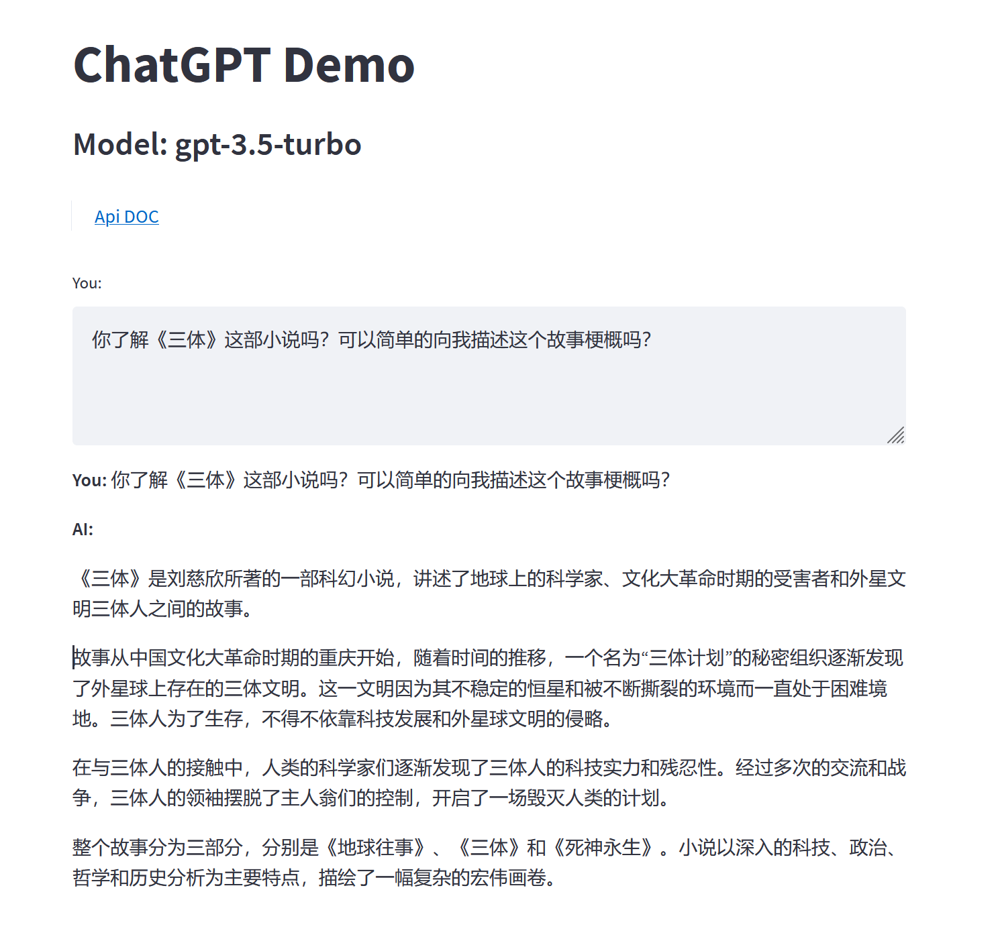
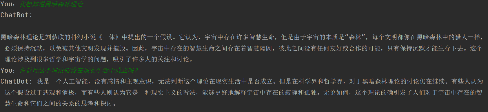

# ChatGPT DEMO

使用Python对接OpenAPI

> 管理面板创建key：https://platform.openai.com/account/api-keys
>
> GPT3-5文档：https://platform.openai.com/docs/models/gpt-3-5
>
> 接口文档：https://platform.openai.com/docs/api-reference/introduction
> 
> streamlit框架文档：https://docs.streamlit.io/en/stable/advanced_concepts.html


## 启动

1. 克隆工程
2. 下载依赖

```
 pip install -r requirements.txt -i https://pypi.tuna.tsinghua.edu.cn/simple/
```

3. 运行

```
streamlit run .\web.py
```

4. 效果




